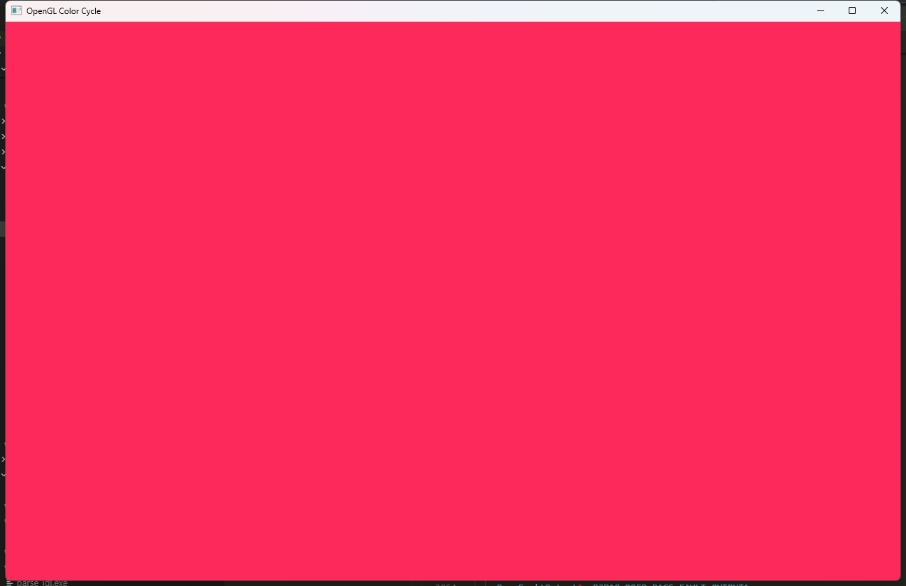
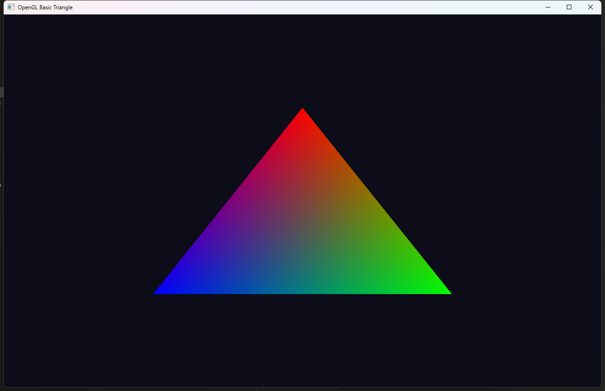
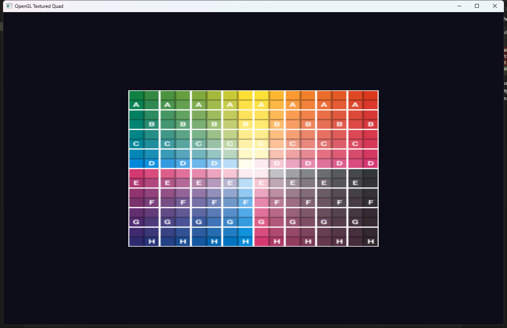
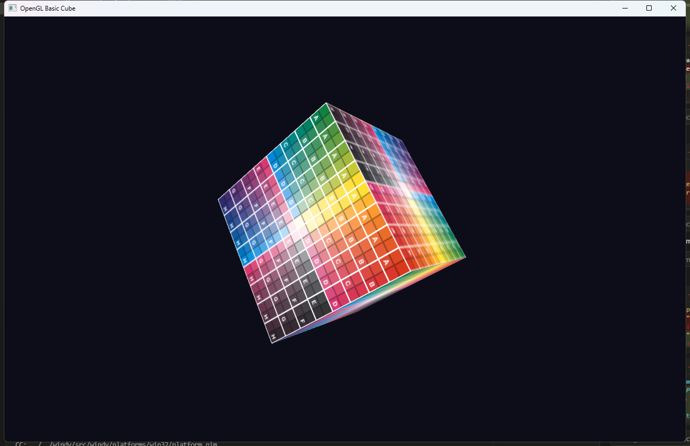
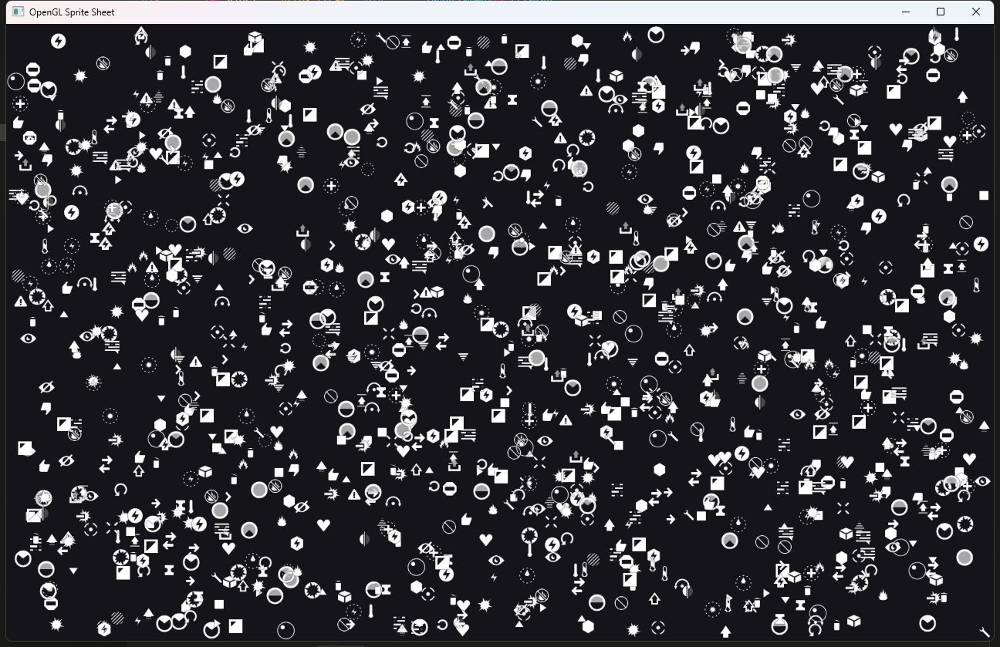
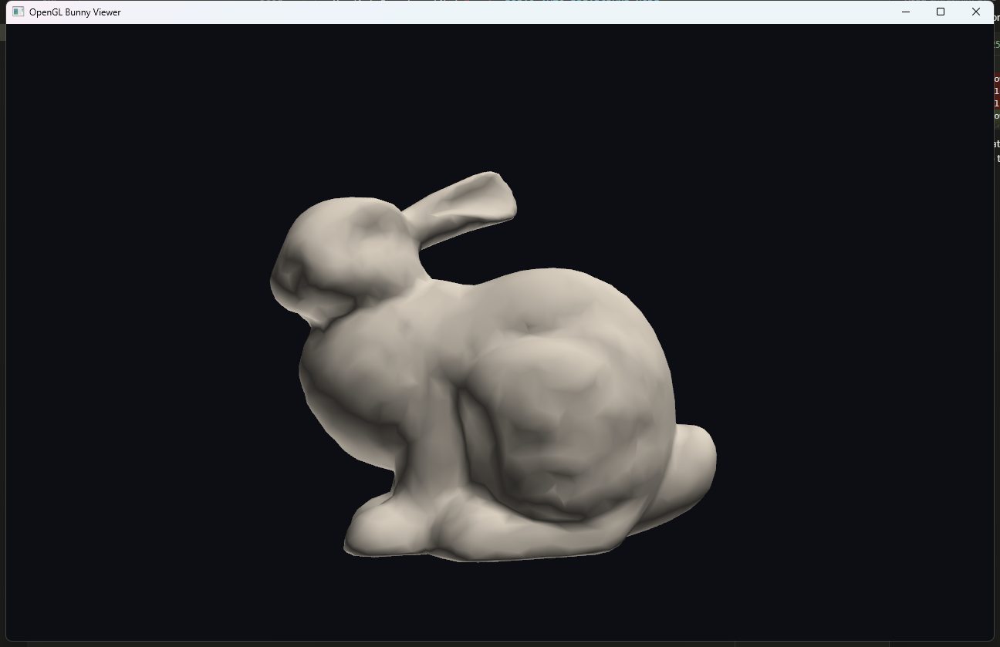

# ogl46 - OpenGL 4.6 DSA wrapper for Nim.

`nimby install ogl46`


[API reference](https://treeform.github.io/ogl46)

## About

I think OpenGL gets a bad rap. Yes, there have been many different versions -- from
OpenGL 1.x, which relied on immediate-mode calls like `glColor3f`, `glVertex3f`,
and `glBegin`/`glEnd`, all the way up to the modern programmable shader pipeline.
It has been a messy, messy road to get here.

But I actually think the latest OpenGL -- **OpenGL 4.6 with Direct State Access
(DSA)** -- is a pretty good graphics API model that almost nobody teaches properly.
With DSA, you can create objects, operate on them directly, and set their parameters
without ever binding them to global state first. It feels like a very natural,
object-oriented API. Yet almost nobody teaches OpenGL this way, and almost nobody
provides examples written this way.

`ogl46` is a small library that wraps standard OpenGL in a **Nim-first API**,
where you create tidy Nim objects and don't have to think about the raw GL calls
happening underneath. It imports the standard Nim `opengl` bindings internally
but only exposes the Direct State Access subset with type-safe enums and distinct
handle types. The legacy bind-to-edit API is completely hidden.

> **AI disclaimer: Much of this library was AI generated.**

### Documentation

[API reference](https://treeform.github.io/ogl46)

## The Three Styles of OpenGL

### 1. Traditional OpenGL (Bind-to-Edit)

In classic OpenGL, you must bind an object to a global target before you can modify
it. Every operation implicitly acts on whatever is currently bound:

```nim
# Create and upload a texture the traditional way
var texture: GLuint
glGenTextures(1, addr texture)
glBindTexture(GL_TEXTURE_2D, texture)
glTexImage2D(
    GL_TEXTURE_2D,
    0, GL_RGBA8.GLint, width.GLsizei, height.GLsizei,
    0, GL_RGBA, GL_UNSIGNED_BYTE, addr pixels[0]
)
glTexParameteri(GL_TEXTURE_2D, GL_TEXTURE_MIN_FILTER, GL_LINEAR.GLint)
glTexParameteri(GL_TEXTURE_2D, GL_TEXTURE_MAG_FILTER, GL_LINEAR.GLint)
glTexParameteri(GL_TEXTURE_2D, GL_TEXTURE_WRAP_S, GL_REPEAT.GLint)
glTexParameteri(GL_TEXTURE_2D, GL_TEXTURE_WRAP_T, GL_REPEAT.GLint)
glBindTexture(GL_TEXTURE_2D, 0)

# Create and fill a vertex buffer the traditional way
var vbo: GLuint
glGenBuffers(1, addr vbo)
glBindBuffer(GL_ARRAY_BUFFER, vbo)
glBufferData(
    GL_ARRAY_BUFFER,
    vertices.len * sizeof(float32),
    addr vertices[0], GL_STATIC_DRAW
)
glBindBuffer(GL_ARRAY_BUFFER, 0)
```

This is fragile. The meaning of every call depends on hidden global state, and
forgetting to bind or unbind the right target leads to subtle, hard-to-diagnose
bugs.

### 2. OpenGL 4.5+ with Direct State Access (DSA)

DSA lets you name the object you want to operate on directly. No binding required:

```nim
# Create and upload a texture with DSA
var texture: GLuint
glCreateTextures(GL_TEXTURE_2D, 1, addr texture)
glTextureStorage2D(texture, 1, GL_RGBA8, width.GLsizei, height.GLsizei)
glTextureSubImage2D(
    texture, 0, 0, 0, width.GLsizei, height.GLsizei,
    GL_RGBA, GL_UNSIGNED_BYTE, addr pixels[0]
)
glTextureParameteri(texture, GL_TEXTURE_MIN_FILTER, GL_LINEAR.GLint)
glTextureParameteri(texture, GL_TEXTURE_MAG_FILTER, GL_LINEAR.GLint)
glTextureParameteri(texture, GL_TEXTURE_WRAP_S, GL_REPEAT.GLint)
glTextureParameteri(texture, GL_TEXTURE_WRAP_T, GL_REPEAT.GLint)

# Create and fill a vertex buffer with DSA
var vbo: GLuint
glCreateBuffers(1, addr vbo)
glNamedBufferData(
    vbo, vertices.len * sizeof(float32),
    addr vertices[0], GL_STATIC_DRAW
)
```

Every function takes the object handle as its first argument. There is no hidden
state, no need to bind and unbind, and no risk of accidentally modifying the wrong
object.

### 3. Wrapped in Nim with UFCS

Because DSA functions always take the object as the first parameter, Nim's
**Uniform Function Call Syntax (UFCS)** lets us turn them into clean dot-call
methods. Combined with a thin wrapper that manages lifetimes and provides
type-safe handles, the result feels like a native object-oriented API:

```nim
import ogl

# Create and upload a texture using the Nim wrapper
var texture = newTexture2D(InternalFormat.RGBA8, width, height)
texture.upload(width, height, PixelFormat.RGBA, PixelType.UByte, addr pixels[0])
texture.minFilter = TextureFilter.Linear
texture.magFilter = TextureFilter.Linear
texture.wrapS = WrapMode.Repeat
texture.wrapT = WrapMode.Repeat

# Create and fill a vertex buffer using the Nim wrapper
var vbo = newBuffer(vertices, BufferUsage.StaticDraw)

# Set up a vertex array with typed attribute layout
var vao = newVertexArray()
vao.addBuffer(vbo, [
  attr(0, 3, float32),   # position
  attr(1, 3, float32),   # color
  attr(2, 2, float32),   # uv
])
```

You create objects, call methods on them, set their properties -- and the
underlying DSA calls do all the work. No global state, no binding rituals, just
straightforward code that reads like any other well-designed API.

## Examples

| Example | Description |
|---------|-------------|
| [`basic_screen`](examples/basic_screen.nim) | Window creation, clear color cycling |
| [`basic_triangle`](examples/basic_triangle.nim) | Vertex buffers, shaders, colored triangle |
| [`basic_quad`](examples/basic_quad.nim) | Texture loading, UV mapping, textured quad |
| [`basic_cube`](examples/basic_cube.nim) | 3D transforms, depth testing, MSAA, mip-mapped textures |
| [`sprite_sheet`](examples/sprite_sheet.nim) | Sprite batching, texture atlas, alpha blending |
| [`viewer_obj`](examples/viewer_obj.nim) | OBJ loading, orbit camera, diffuse lighting |

### Example Screenshots

#### `basic_screen`



#### `basic_triangle`



#### `basic_quad`



#### `basic_cube`



#### `sprite_sheet`



#### `viewer_obj`


